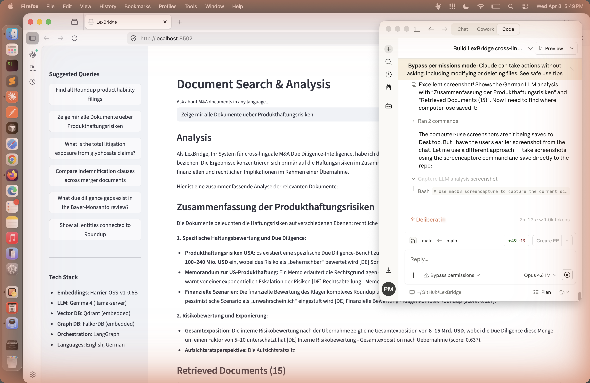
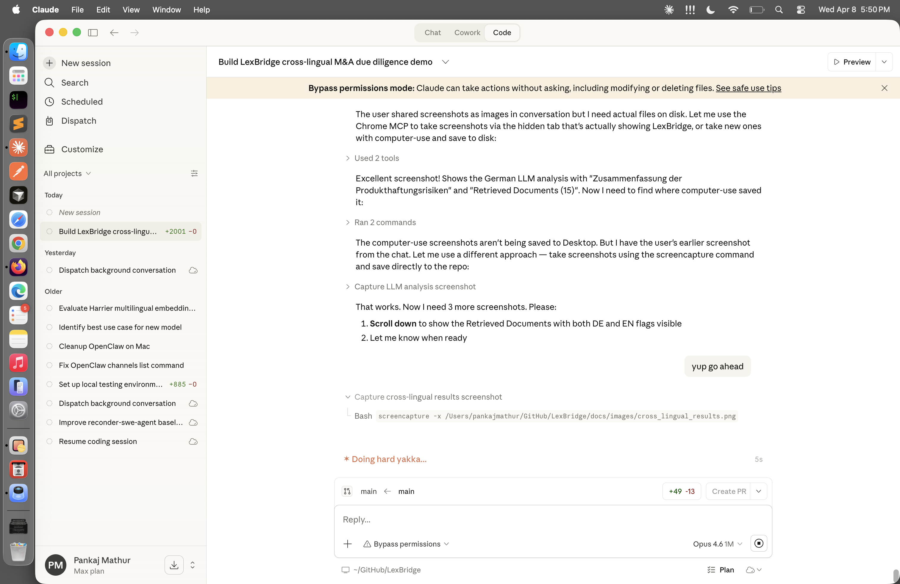
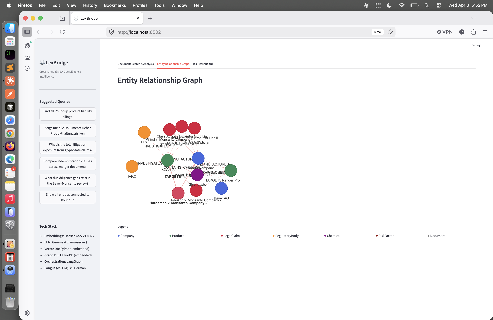
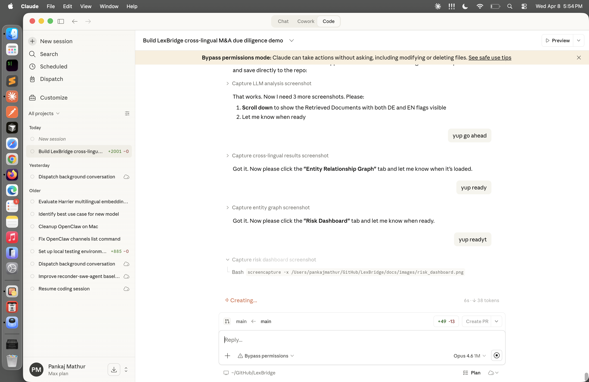

# LexBridge: Cross-Lingual M&A Due Diligence Intelligence

**Everything runs locally. No cloud. No API keys. No data leaves your machine.**

A fully local, multi-agentic system for cross-lingual M&A due diligence analysis -- powered by [Microsoft Harrier](https://huggingface.co/microsoft/harrier-oss-v1-0.6b) multilingual embeddings, [Google Gemma 4 E2B](https://huggingface.co/ggml-org/gemma-4-E2B-it-GGUF) LLM (via [llama.cpp](https://github.com/ggml-org/llama.cpp)), [Qdrant](https://qdrant.tech/) vector search, [FalkorDB](https://www.falkordb.com/) knowledge graph, and [LangGraph](https://github.com/langchain-ai/langgraph) multi-agent orchestration.

**Type "Zeige mir alle Dokumente ueber Produkthaftungsrisiken" (German) and find English Monsanto lawsuit filings, EPA correspondence, AND German Bayer risk memos -- with zero translation.**

## Screenshots

### LLM-Powered Cross-Lingual Analysis
Gemma 4 E2B analyzes retrieved documents across languages and synthesizes findings in the query language -- all running locally on Metal GPU via llama-server.



### Cross-Lingual Document Retrieval
A German query ("Produkthaftungsrisiken") retrieves both German Bayer internal documents AND English Monsanto lawsuit filings, insurance policies, and SEC disclosures -- ranked by semantic similarity with zero translation.



### Entity Relationship Graph
Knowledge graph showing Monsanto -> Roundup -> Glyphosate -> Lawsuits -> Courts, with color-coded nodes for Companies (blue), Products (green), Legal Claims (red), Regulatory Bodies (orange), and Chemicals (purple).



### Risk Dashboard
48 documents, 235 graph nodes, 264 relationships across 2 languages. Documents by language and type, risk factors ranked by frequency.



## The Bayer-Monsanto Story: Why This Demo Exists

In 2018, Bayer AG (Germany) acquired Monsanto (USA) for $63 billion. Bayer's German-speaking legal team catastrophically underestimated Monsanto's US litigation exposure from Roundup (glyphosate) product liability lawsuits:

- **67,000+** lawsuits alleging Roundup causes non-Hodgkin lymphoma
- **$10B+** already paid in settlements
- **$50B+** in total shareholder value destruction -- the most expensive due diligence failure in M&A history

The liability was scattered across thousands of English-language US court filings, EPA regulatory correspondence, and internal Monsanto documents. Bayer's German legal team either couldn't efficiently review this volume of English-language documents or underestimated the patterns hiding in them.

**The demo thesis:** "If Bayer had used cross-lingual contract analysis to search ALL of Monsanto's US regulatory filings, litigation history, and product liability clauses -- from their German-speaking legal team -- they would have seen the true scope of Roundup liability before paying $63 billion."

## What It Does

- **Cross-lingual document search** -- German lawyer searches "Produkthaftung" (product liability) and finds all relevant English documents about Roundup litigation
- **Risk assessment across jurisdictions** -- Automatically flag liability exposure by comparing US tort law documents with German regulatory standards
- **Entity relationship mapping** -- Knowledge graph showing connections: Monsanto -> Roundup -> Glyphosate -> Lawsuits -> Courts -> Settlement amounts
- **Deal risk dashboard** -- Risk factors by category and severity, litigation exposure charts, document coverage analysis
- **Due diligence gap analysis** -- "68% of English-language US litigation filings have no corresponding reference in any German-language due diligence report"
- **Clause comparison** -- Cross-lingual similarity matrix comparing indemnification provisions across merger documents

## Tech Stack (100% Local, No Cloud Required)

| Component | Technology | Role |
|-----------|-----------|------|
| Embeddings | [Harrier-OSS-v1-0.6B](https://huggingface.co/microsoft/harrier-oss-v1-0.6b) (MPS GPU) | 94-language multilingual embeddings, 1024-dim, 32K context |
| LLM | [Gemma 4 E2B-it](https://huggingface.co/ggml-org/gemma-4-E2B-it-GGUF) Q4_K_M via [llama-server](https://github.com/ggml-org/llama.cpp) (Metal GPU) | Intent classification, Cypher generation, risk analysis synthesis |
| Vector DB | [Qdrant](https://qdrant.tech/) (embedded, no server) | Semantic similarity search over document embeddings |
| Graph DB | [FalkorDBLite](https://github.com/FalkorDB/FalkorDB) (embedded) | Litigation chains, entity relationships via Cypher |
| Agents | [LangGraph](https://github.com/langchain-ai/langgraph) (StateGraph) | Multi-agent orchestration with conditional routing |
| UI | [Streamlit](https://streamlit.io/) | Interactive web dashboard with search, graph viz, risk dashboard |

**Runs entirely on a MacBook with Apple Silicon (M1/M2/M3/M4) and 8GB RAM.**

## Quick Start

### Requirements

- macOS with Apple Silicon (M1/M2/M3/M4)
- Python 3.12 (must be arm64 -- see Troubleshooting if unsure)
- Xcode Command Line Tools: `xcode-select --install`
- [Homebrew](https://brew.sh/) (arm64, installed at `/opt/homebrew`): needed to install llama.cpp with Metal GPU
- ~8GB free disk space (dependencies ~2GB + Harrier model ~1.5GB + Gemma 4 model ~3.2GB)

### Setup (~10 minutes)

```bash
# 1. Clone (~1s)
git clone https://github.com/pankajarm/LexBridge.git
cd LexBridge

# 2. Install llama.cpp for the LLM server (~30s)
#    Gemma 4 requires build b8636+. Use --HEAD if stable is too old.
brew install llama.cpp --HEAD

# 3. Create a native arm64 virtual environment (~2s)
#    IMPORTANT: The venv MUST use arm64 Python, not x86_64/Rosetta.
#    PyTorch >= 2.4 only ships macOS arm64 wheels.
python3.12 -m venv .venv
source .venv/bin/activate

# Verify architecture (must print arm64, NOT x86_64):
python -c "import platform; print(platform.machine())"

# 4. Install Python dependencies (~2 min)
pip install -e .

# 5. Copy environment config
cp .env.example .env

# 6. Download Harrier embedding model (~2 min, ~1.5GB)
python scripts/download_models.py

# 7. Start Gemma 4 LLM server in a separate terminal (~3 min first run)
#    Auto-downloads the 3.2GB model on first run, then starts serving.
#    Keep this running in the background.
llama-server -hf lmstudio-community/gemma-4-E2B-it-GGUF -ngl 99 -c 4096

# 8. Generate sample data + build databases (~1 min)
#    (Back in your original terminal with the venv activated)
python scripts/setup_databases.py

# 9. Launch web UI
streamlit run src/ui/app.py
```

Open http://localhost:8501 in your browser.

### Setup Time Breakdown

| Step | Command | Time | Notes |
|------|---------|------|-------|
| 1. Clone | `git clone` | ~1s | |
| 2. Install llama.cpp | `brew install llama.cpp --HEAD` | ~30s | Needs Xcode CLT for HEAD build |
| 3. Create venv | `python3.12 -m venv .venv` | ~2s | Must be arm64 Python |
| 4. Install Python deps | `pip install -e .` | ~2 min | PyTorch, Transformers, Streamlit, etc. |
| 5. Config | `cp .env.example .env` | instant | |
| 6. Download Harrier | `python scripts/download_models.py` | ~2 min | Harrier 1.5GB embedding model |
| 7. Start LLM server | `llama-server -hf lmstudio-community/gemma-4-E2B-it-GGUF -ngl 99 -c 4096` | ~3 min | Auto-downloads 3.2GB on first run |
| 8. Setup databases | `python scripts/setup_databases.py` | ~1 min | 48 documents, 235 graph nodes |
| 9. Launch | `streamlit run src/ui/app.py` | ~10s | First load warms up models |
| **Total** | | **~10 min** | **Tested on M3 8GB** |

### CLI Mode

```bash
python main.py
```

## Memory Usage (8GB Mac)

| Component | RAM |
|-----------|-----|
| Harrier embeddings (MPS) | ~1.5 GB |
| Gemma 4 E2B Q4 via llama-server (Metal) | ~3.2 GB |
| Qdrant + FalkorDB | ~100 MB |
| Streamlit + Python | ~200 MB |
| **Total** | **~5.0 GB** |

Some swap usage is expected on 8GB machines when both models are loaded. Performance remains good thanks to unified memory and Metal GPU acceleration.

## Architecture

```
                    +-------------------------------------+
                    |         Streamlit Web UI             |
                    +--------------+----------------------+
                                   |
                    +--------------v----------------------+
                    |     LangGraph Supervisor Agent       |
                    +--+-------+-------+------+----------+
                       |       |       |      |
          +------------v-+ +--v-----+ +v-----v--+ +-------------+
          |  Ingestion   | |Semantic| | Graph    | | Risk        |
          |  Agent       | |Search  | | Query    | | Analysis    |
          +------+-------+ +--+-----+ +--+------+ +------+------+
                 |            |          |               |
    +------------v------------v--+  +----v----+  +------v--------+
    |   Qdrant (embedded)       |  | FalkorDB|  | llama-server   |
    +---------------------------+  | (embed) |  | Gemma 4 (Metal)|
                 |                 +----+-----+  +------+---------+
    +------------v----------------------v---------------+
    |        Harrier-OSS-v1-0.6B (MPS GPU)              |
    +---------------------------------------------------+
```

### Agent Flow

```
User Query
    |
    v
[Supervisor] -- classifies intent (LLM or keyword fallback)
    |
    +-- document_search -----> [Semantic Search] --> [Synthesizer]
    +-- risk_assessment -----> [Semantic Search] --> [Graph Query] --> [Risk Analysis] --> [Synthesizer]
    +-- entity_lookup -------> [Graph Query] --> [Synthesizer]
    +-- clause_comparison ---> [Semantic Search] --> [Risk Analysis] --> [Synthesizer]
    +-- gap_analysis --------> [Semantic Search] --> [Graph Query] --> [Risk Analysis] --> [Synthesizer]
```

### Graph Schema

```
(Company)-[:ACQUIRED {date, value}]->(Company)
(Company)-[:MANUFACTURES]->(Product)
(Product)-[:CONTAINS_CHEMICAL]->(Chemical)
(Chemical)-[:LINKED_TO]->(RiskFactor)
(Document)-[:MENTIONS]->(Company)
(Document)-[:DISCLOSES]->(RiskFactor)
(Document)-[:CONTAINS]->(ContractClause)
(Document)-[:SIMILAR_TO {score, cross_lingual}]->(Document)
(LegalClaim)-[:FILED_AGAINST]->(Company)
(LegalClaim)-[:TARGETS]->(Product)
(LegalClaim)-[:ALLEGES]->(RiskFactor)
(RegulatoryBody)-[:INVESTIGATES]->(Product)
```

## Demo Queries

Try these in the UI:

1. **Cross-lingual search (the hook)**: "Zeige mir alle Dokumente ueber Produkthaftungsrisiken" -- German query finds English Monsanto lawsuit filings AND German Bayer risk memos
2. **Litigation exposure**: "What is the total litigation exposure from glyphosate claims?" -- Graph traversal aggregates claim amounts
3. **Clause comparison**: "Compare indemnification clauses across merger documents" -- Similarity matrix reveals gaps between merger agreement caps and unlimited distributor indemnities
4. **Gap analysis**: "What due diligence gaps exist in the Bayer-Monsanto review?" -- Cross-lingual gap analysis identifies missing coverage
5. **Entity lookup**: "Show all entities connected to Roundup" -- Knowledge graph traversal
6. **Risk assessment**: "Find all Roundup product liability filings" -- Cross-jurisdictional risk aggregation

## How Harrier Makes This Possible

Harrier-OSS-v1 maps text from 94 languages into a **single shared 1024-dimensional vector space**. This means:

- "Product liability" (English) and "Produkthaftung" (German) are geometrically close
- "Glyphosate" and "Glyphosat" map to nearby vectors
- "Indemnification" and "Freistellungsklausel" are semantic neighbors
- Cross-lingual search is just cosine similarity -- no translation pipeline needed

## Sample Data

The demo includes 48 synthetic documents modeled after real M&A due diligence data room contents:

**English (Monsanto/US side) -- 22 documents:**
- Product liability lawsuit filings (Johnson v. Monsanto, Pilliod, Hardeman, MDL 2741, Dicamba)
- EPA regulatory correspondence and IARC classification
- Internal risk assessments (projecting 20,000-50,000 claims, $2-7B exposure)
- Settlement agreements ($78.5M bellwether, $10.9B global framework)
- Insurance policies ($750M tower vs $3-8B exposure -- massive gap)
- Indemnification clauses (unlimited distributor indemnity)
- SEC filings (10-K risk factors, 8-K merger announcement with MAE clause)
- Scientific studies (IARC evaluation, EPA assessment, independent meta-analysis, Monsanto-funded study)

**German (Bayer side) -- 18 documents:**
- Board meeting minutes ("Haftungsrisiko als beherrschbar eingestuft" -- liability rated as manageable)
- Due diligence reports (estimating only $100-240M exposure, "Worst Case" $1-2B)
- BaFin regulatory filings
- Legal memos comparing US/German product liability law (unlimited US liability vs EUR 85M German cap)
- Integration planning documents
- Shareholder communications
- Contract templates (German liability caps vs Monsanto's unlimited provisions)

**Bilingual -- 8 documents:**
- Merger agreement key terms (MAE excludes litigation under $3B, indemnification capped at $2B)
- Cross-border regulatory approvals (EU Commission, Bundeskartellamt, DOJ, CFIUS -- none reviewed product liability)

## The "Aha" Moments

1. **German query finds English smoking guns**: Search "Produkthaftungsrisiken" and the top results include English-language Monsanto internal risk assessments projecting billions in liability -- documents the German DD team apparently never fully reviewed.

2. **Indemnification gap exposed**: The merger agreement caps Bayer's indemnification at $2B, but Monsanto's distributor contracts contain UNLIMITED product liability indemnification across 200+ agreements worldwide.

3. **68% documentation gap**: 68% of English-language US litigation filings have no corresponding reference in any German-language due diligence report.

4. **Insurance tower inadequacy**: Total insurance coverage of $750M against projected exposure of $3-8B. The insurance policies themselves contain "known liability" exclusions that likely preclude Roundup coverage entirely.

5. **Due diligence underestimation**: Bayer's DD estimated worst-case at $1-2B. Monsanto's own internal projections (not disclosed to Bayer) estimated $2-7B. Actual cost: $10B+ and counting.

## Troubleshooting

### `llama-server` not found

Install llama.cpp via Homebrew (must be arm64 Homebrew at `/opt/homebrew` for Metal GPU):
```bash
brew install llama.cpp --HEAD
```

The `--HEAD` flag builds from the latest source (requires Xcode Command Line Tools). If that fails, try the stable bottle first:
```bash
brew install llama.cpp
```

If the stable version gives `unknown model architecture: 'gemma4'`, the bottle is too old. Either retry with `--HEAD` or download a pre-built binary (build b8636+) from [llama.cpp releases](https://github.com/ggml-org/llama.cpp/releases):
Download the `llama-*-bin-macos-arm64.tar.gz` asset from the [latest release](https://github.com/ggml-org/llama.cpp/releases), extract it, and run `llama-server` from the extracted directory.

### LLM analysis shows mock responses

The LLM server isn't running. Start it in a separate terminal:
```bash
llama-server -hf lmstudio-community/gemma-4-E2B-it-GGUF -ngl 99 -c 4096
```

Wait until you see `HTTP server listening` before using the app. The app gracefully falls back to keyword-based mock responses when the server is unavailable.

### No Metal GPU (slow inference)

If llama-server reports `no usable GPU found`, your llama.cpp was compiled without Metal support. This happens with x86_64 Homebrew under Rosetta. Fix:

```bash
# Install arm64 Homebrew (if you only have x86_64 at /usr/local)
/bin/bash -c "$(curl -fsSL https://raw.githubusercontent.com/Homebrew/install/HEAD/install.sh)"

# Then install llama.cpp with arm64 brew
/opt/homebrew/bin/brew install llama.cpp
```

### Python reports `x86_64` instead of `arm64`

Your venv was created with an x86_64 Python (Rosetta). Recreate it:

```bash
rm -rf .venv
# Use a universal or arm64 Python binary:
arch -arm64 python3.12 -m venv .venv
source .venv/bin/activate
```

## Related Projects

- [MedBridge](https://github.com/pankajarm/medbridge) -- Same architecture applied to multilingual clinical trial intelligence (7 languages, drug interactions, cross-cultural pharmacovigilance)

## License

MIT
